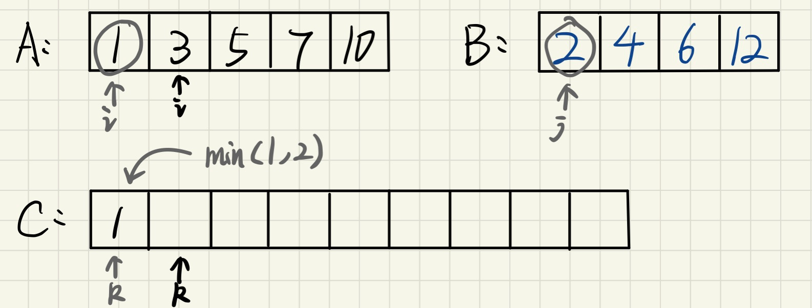

# 合并两个有序的数组 merge sorted array

## 问题描述：


已有两个有序的数组，设分别为A和B。要得到合并后的有序数组C。

> - 假设这两个数组长度分别为m和n，则合并后的数组长度为m+n图中A和B数组长度分别为5和4（即m=5，n=4），C数组的长度为9。


## 算法思路：

#### 初始化（Step1）


1. 先创建一个缓冲数组C（C的长度为m+n）

2. 设置三个游标，i 和 j 分别指向A和B数组的第一个元素；k 指向C数组的第一个元素


#### 比较并填充（Step2）



1. **比较数值**：比较 i 游标和 j 游标所指的元素值大小，将较小者填入C数组中。

> 即比较A[i]和B[j]的大小，并将较小者赋值给C[k]

2. **移动游标**：将A和B中填入C的那个游标右移（图中是i），将C的游标右移动。


#### 将A or B 还未遍历的元素直接拼接到C（Step3）


因为Step2中，A和B数组的长度不一定相同，并且遍历有先后顺序。因此一定存在A or B中还有未遍历完的元素的情形。

> 上图描述了两种未遍历完的情形：Case1中A先遍历完，B还未遍历完；Case2中B先遍历完，A还未遍历完。

1. 可以根据A和B游标的值和各自的数组长度做比较，从而判断是哪种情形

   > 比如Case1中：A的数组长度是5，游标值也为5（数组下标从0开始）。则可以说明是A数组先遍历完。

2. 根据对应的情形，将未遍历完的数组元素直接拼接到C后。

   > 比如Case1中，需要将B中剩余的元素11和12直接拼接到C数组中。


# 合并算法的小变形

为了便于后续封装利用，做了小小的改动：

两个有序的数组 ( A[p]~A[q]及A[q+1]~A[r]已按递增顺序排序 )

> 即A和B数组用一个数组A来表示，参数p，q，r代表这个两个子数组的范围。
>
> 可以理解为：A[p]~A[q]代表A数组，A[q+1]~A[r]代表B数组

```c++
/*
    合并两个有序的子数组 ( A[p]~A[q]及A[q+l]~A[r]已按递增顺序排序 )
    输入:整数数组A[p]~A[r],元素个数n
        下标p , q , r
    输出:按递增顺序排序的子数组A[p]~A[r]
 */
void merge(int A[], int p, int q, int r, int n) {
    int *B = new int[n];        // 建立缓冲区
    int k = 0;                  // 指向B的游标，主要用于插入数据进B中
    int i = p, j = q + 1;
    while (i <= q && j <= r) {                  // while循环的跳出条件是：i和j只要有一个超过各种数组的界限
        if (A[i] >= A[j]) {
            B[k++] = A[j++];
        } else {
            B[k++] = A[i++];
        }
    }
    if (i == q+1) {    // 说明是前半段先遍历完，把后半段的拼到数组后面
        while (j <= r) {
            B[k++] = A[j++];
        }
    } else {
        while (i <= q) {
            B[k++] = A[i++];
        }
    }
    // 将选定的部分替换为B的数组
    k = 0;
    for (i = p; i <= r; i++) {
        A[i] = B[k++];
    }
    delete[] B;
}
```


## 蹭热打铁（刷Leetcode）

88：合并两个有序数组

https://leetcode-cn.com/problems/merge-sorted-array/

88：merge sorted array

https://leetcode.com/problems/merge-sorted-array/