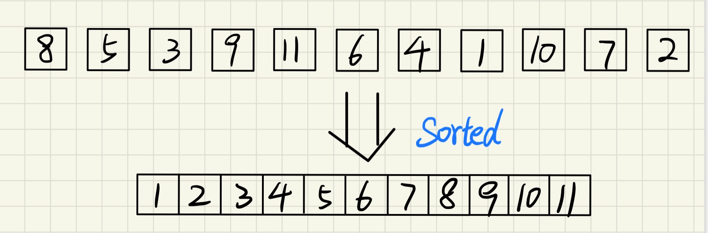
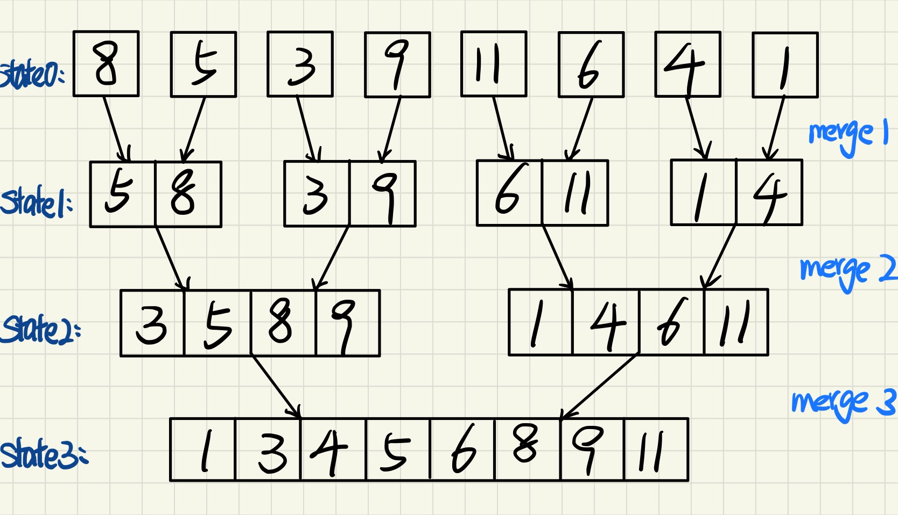
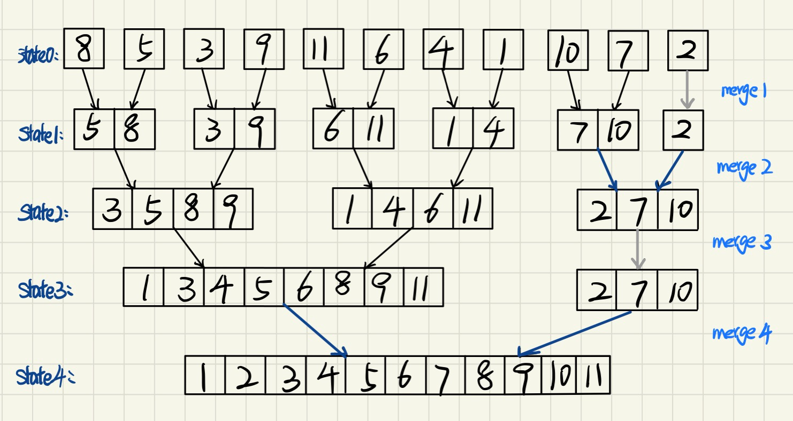

# 归并排序的非递归实现 merge sorte

归并排序也称为合并排序，本文详细介绍归并非递归的实现。



## 问题描述

有一串乱序的数字，将它们（利用合并排序的思想）排列成有序的。

> 通常使用一个数组来保存这个串无序的序列，输出也用一个数组来表示

**输入：**乱序的数组A，数组的长度n

**输出**：有序的数组A


## 特殊情形(元素个数为$2^{i}$)

#### 基本思路：看作是一颗倒过来的满二叉树，两两成对



这张图叙述了合并排序算法的基本思路，类似一棵倒放的二叉树。

> 图中标记的解释：state0代表初始的状态，经过第一趟合并（merge1）之后得到的状态为State1，以此类推。

### **归并排序的基本思路**

1. 在State0初始状态时，**两两合并**，合并用到的算法是“合并有序的数组 merge sorted array”。即每次合并得到的都是有序的数组。

   **两两合并的规则是**：将两个相同序列长度的序列进行合并，合并后的序列长度double。

   > 第一趟合并（merge 1）调用了4次merge sorted array，得到了4个有序的数组："5, 8"，"3, 9"，"6, 4"，"1, 4"（每个合并后的序列长度为2）
   >
   > 第二趟合并（merge 2）调用了2次merge sorted array，得到了2个有序的数组："3, 5, 8, 9"，"1, 4, 6, 11''（每个合并后的序列长度为4）

2. 按步骤1的思想以此类推，经过多次合并最终得到有序的数组，也就是State3。

   > 可以看出经过一共3趟合并，最终得到有序的数组。
   >
   > 可以看出每趟要执行的合并次数不同，第一趟合并执行4次，第二趟合并执行2次，第三趟合并行1次。

### **归并排序的循环体设计思路**

看了上述的算法思想，可以知道算法可以设计成两层循环

> 1. 外层循环遍历趟数
> 2. 内层循环遍历合并次数

下面的伪码描述了两层循环体的实现：

```c++
merge_sort(A[], n) {
    while (趟数条件) {	// 外层循环：合并的大趟数 
        while (执行合并的条件) {	// 内层循环：每趟合并的次数
        // 进行两两合并
        }
    }
}
```


## 一般情形（数组的元素个数不一定是 $2^{i}$）



如图可知，一般数组元素的个数不一定是 $2^{i}$个。右边多出的"10, 7, 2"子树可以视作一般情况的情形。

> 虽然元素个数不一定是$2^{i}$个，但是任意元素个数的n，必然可以拆分成$2^{j}$+m个元素的情形（数学条件不去深究）

由图可知，特殊情形思想中的**两两合并**的规则不能满足一般情况的合并需求

> - 图中灰色的箭头代表无需合并，因为找不到配对的元素。
> - 图中墨蓝色的箭头代表两个长度不相等的元素也需要进行合

将上述的合并需求称为**长短合并**，容易知道长短合并仅存在1次或0次。

下面讨论的合并前/后的序列长度特指**两两合并**后得到的序列长度。


### 合并趟数的循环设计

虽然<u>一般情形</u>与<u>特殊情形</u>的合并规则有差别（一般情形复杂），但是可以设计一个通用的合并趟数条件。
设置变量t：记录每趟合并**后**序列的长度（t=$2^{k}$），其中k是趟次（如图中的merge1、2、3、4）

> - 通过观察发现：每次合并后序列的大小有规律，第一趟后合并的序列大小都是2，第二趟合并后的序列大小都是4，以此类推..
>- "10, 7, 2"这三个元素组合而成的序列长度虽然不满足上述的规律，但是并不影响趟数的计算。$2^{4}$=16 ≥ 11，4趟后循环结束。
> - 可以设计成：if 最后合并后的序列长度≥实际元素的个数n，这时可以说明循环结束

下面的伪代码给出了合并趟数的循环设计，以及循环结束的条件。

```c++
merge_sort(A[], n) {
    int t = 1;  // t：每趟合并后序列的长度
    while (t<n) { // 合并趟数的结束条件是：最后合并后的序列长度t≥数组元素的个数n
        t *= 2;
        // TODO：每趟进行两两合并
    }
}
```

### 每趟合并次数的循环设计

从上图可以看出：每趟的合并次数和**元素的总数n**有关，且和**合并前/后的序列长度**有关。

> 数组的元素总数n越大，自然需要合并的次数更多。
>
> 每趟合并前序列长度越长，这趟需要合并的次数更少。

<u>设置变量s：记录合并前序列的长度</u>

下面列出了一般情形下的合并数学规律

> 记m为两两合并的次数（图中每对黑色箭头代表一次两两合并）
>
> 记j为长短合并的次数（图中每对墨蓝箭头代表一次长短合并）

第一趟合并 ：n=11，s=1，t=2，m=5，j=0

第二趟合并 ：n=11，s=2，t=4，m=2，j=1

第三趟合并 ：n=11，s=4，t=8，m=1，j=0

第四趟合并 ：n=11，s=8，t=16, m=0，j=1

存在公式：m = n / t，j =(n % t  > s ) ? 1: 0 可以设计如下的内层循环

<u>设置变量i：记录合并时第一个序列的起始位置</u>

> 其中第二个公式不太好理解，可以以merge2的合并过程作为参考：
>
> 两两合并得到了"3, 5, 8, 9"，"1, 4, 6, 11"两个序列后。还剩余3个元素，因为3>2=s，所以还要进行长短合并。

```c++
merge_sort(A[], n) {
    int t = 1;
    int i;	// 每趟合并时第一个序列的起始位置
    int s; 	// 合并前序列的长度
    while (t < n) {
        t *= 2;
        i = 0;
        s = t;
        while(i + t < n) {// 每趟进行两两合并，结束条件：
            // TODO：两两合并操作(对两个长度相等的数组进行合并)
            i = i + t
        }
        if (i + s < n) {	// 判断：还有两两长度不相同的数组需要合并
            // TODO：长短合并操作(对于长度不相同的数组进行合并)
        }
    }
}
```


# 归并排序的完整代码

```c++
/**
 * 归并排序算法
 * @param A 乱序数组A 
 * @param n 数组A的元素个数
 */
void merge_sort(int A[], int n) {
    int i,s;  
    int t = 1;
    while (t < n) {		// 外层循环：合并的大趟数  
        s = t;
        t *=2;
        i = 0;
        while (i + t < n) {		// 内层循环：每趟需要合并的次数
            merge(A, i, i+s-1, i+s*2-1, t); 
            i = i + t;
        }
        if (i + s < n) {  // 判断还有剩下的元素待处理。
            merge(A, i, i+s-1, n-1, n-i);
        }
    }
}
```

其中merge算法的实现，请查看我的上一篇文章介绍：合并两个有序的数组 merge sorted array。下面给出了实现

```c++
/**
 * 合并两个有序的子数组( A[p]~A[q]及A[q+l]~A[r]已按递增顺序排序 )
 * @param A 整数数组
 * @param p 第一个子数组的起始下标
 * @param q 第一个子数组的末尾下标
 * @param r 第二个字数组的末尾下标
 * @param n A数组的元素个数
 */
void merge(int A[], int p, int q, int r, int n) {
    int *B = new int[n];        // 建立缓冲区
    int k = 0;                  // 指向B的游标，主要用于插入数据进B中
    int i = p, j = q + 1;
    while (i <= q && j <= r) {                  // while循环的跳出条件是：i和j只要有一个超过各种数组的界限
        if (A[i] >= A[j]) {
            B[k++] = A[j++];
        } else {
            B[k++] = A[i++];
        }
    }
    if (i == q+1) {    // 说明是前半段先遍历完，把后半段的拼到数组后面
        while (j <= r) {
            B[k++] = A[j++];
        }
    } else {
        while (i <= q) {
            B[k++] = A[i++];
        }
    }
    // 将选定的部分替换为B的数组
    k = 0;
    for (i = p; i <= r; i++) {
        A[i] = B[k++];
    }
    delete[] B;
}
```


