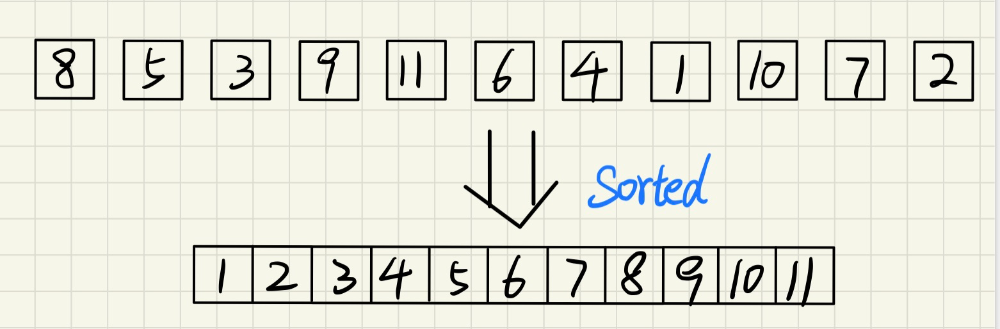
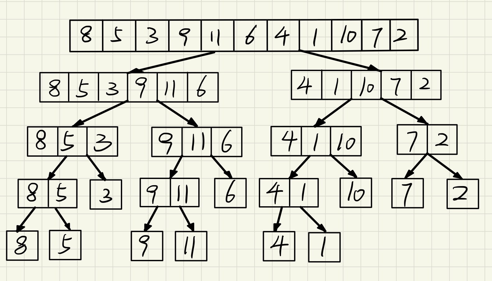
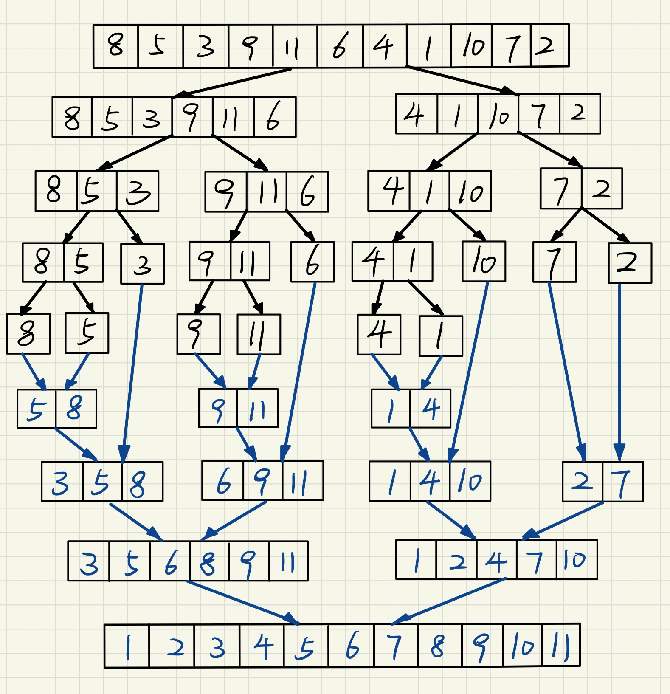

# 归并排序的递归实现 merge sort

归并排序又称合并排序，递归的实现一般用到**分治法**的思想。本文详细介绍归并排序的递归实现。

> - 直接或间接地调用自身的算法称为递归算法。
> - 分治法的设计思想是：将一个难以直接解决的大问题，分割成一些规模较小的相同问题，以便各个击破，分而治之。
> - 分治和递归像一对孪生的兄弟，经常同时应用在算法设计中。



## 分治法的基本思想

分治法的基本思想可以简单概述为三步：

1. 将一个规模为n的问题分解为k个规模较小的子问题。

   > 这些子问题互相独立，且与原问题相同。

2. 递归地解这些子问题。

3. 将各个子问题的解合并。

下面的伪代码描述了分治法的一般设计模式：

```c++
divide-and-conquer(P){
    if (| P | <= nO) adhoc(P);
    divide P into smaller subinstances Pl, P2, ..,Pk;
    for (i = l;i <= k; i++ )
        yi = divide-and-conquer(Pi);
    return merge(y1, y2, ..,yk);
}
```


## **为什么分治法适用**

> 快速排序也可用使用分治法解决，而归并排序之所以叫归并，体现在子问题的解决上：
>
> 因为解决子问题用到的思想是：**合并两个有序的数组 merge sorted array**

如下图所示：归并排序之所以可以用分治法解决的是因为：

1. 问题规模缩小到一定程度就可以容易地解决。

   > 如果缩小到数组的长度只有2，那么我们可以利用前面介绍的**合并两个有序的数组 merge sorted array**算法：
   >
   > 可以看作”将两个长度为1（有序）的数组的合并“的问题，问题很容易得到了解决。

2. 问题都可以分解为若干规模较小的相同问题。

   > 假设需要排序的数组长度为n，那么：n/2长度子序列的排序，n/4、n/8长度的子序列，直至2个元素的子序列的排序，都是相同的问题。

3. 分解出的子问题，是相互独立的。

4. 分解出的子问题可以合并成原问题的解。

   > 从最小的子问题入手：将两个长度为1（有序）的数组的合并，得到长度为2的有序的数组。
   >
   > 中间不断处理子问题：将两个有序的数组合并成一个更大的有序数组，以此类推...
   >
   > 到最后：两个最长的有序子序列（从原数组分解而来）合并成一个有序的数组，得到原数组的排序。


## 归并排序分治法的"分"

下图介绍了二路归并的子问题“分”法



怎么分，以及分到什么程度是需要考虑的

#### 怎么分

如果按一分为二，二分为四，四分为八的规则来分，就叫做二路归并（也是归并排序默认）

如果按一分为三，三分为九，九分为二十七的规则来分，就叫做三路归并。。。以此类推

当然怎么分就要考虑怎么合，因为我们反复提到了**合并两个有序的数组 merge sorted array**，显然分两路是最简单的，可以利用现成的算法去解决合并。

#### 分到什么程度

分到什么程度，首先要明确最小的子问题是什么。

**最小的子问题**：解决2个数组长度时的排序问题，即将两个长度为1的数组进行有序合并。

数组长度为2时还要分一次，分成两个长度为1的子序列，转而开始做“合”（也就是治）的操作。

> 图中''8, 5"，''9, 11"，''4, 1"，''7, 2"分别分成"8", "5"，"9", "11"之类时就要转而开始做合的操作了。

数组长度为1的子序列本身已经是有序的，所以不需要做任何处理。


## 归并排序分治法的"分和治"



图中描述了归并排序递归实现程序运行的过程：每对黑色的箭头代表“分”操作，每对墨蓝色的箭头代表“合”操作（也就是治）

分治法的运行过程可以看作是对称的，每“分”一次，就需要“治”一次。

> 虽然上图像看似不对称，实际数下箭头就会发现对称之处：
>
> - 图中有10对黑色箭头：代表进行了10次分，即每次分都将问题分解成了2个子问题。
> - 图中有10对墨蓝箭头：代表进行了10次治，即每次治都将2个子问题进行解决（合并两个有序的数组 merge sorted array）。


# 归并排序的递归实现完整代码

递归程序的代码很少，难在理解原理。

```c++
/**
 * 合并排序的递归实现（分治法）
 * @param A 乱序的数组A
 * @param low 数组的起始下标
 * @param high 数组的末尾下标
 */
void merge_sort(int A[], int low, int high) {
    if (low < high) {   // 说明至少还存在两个元素：需要进行分
        int i = (low + high) / 2;       // 获得中间位置的下标(偏左)
        merge_sort(A, low, i);          // 分操作：对左半部分的子序列递归调用
        merge_sort(A, i+1, high);   // 分操作：对右半部分的子序列递归调用
        merge(A, low, i, high, high-low+1); // 治操作：解决有序两个子序列的合并
    }
}
```

运行测试：

```c++
int main(int argc, const char * argv[]) {
    int a[] = {8, 5, 3, 9, 11, 6, 4, 1, 10, 7, 2, 11};
    merge_sort(a, 0, 10);   // 归并排序的非递归实现
    for (int i=0;i < 11; i++) {
        printf("%d ",a[i]);
    }
    // 1 2 3 4 5 6 7 8 9 10 11 
    return 0;
}
```

其中merge算法的实现，请查看我的上一篇文章介绍：合并两个有序的数组 merge sorted array。下面给出了实现：

```c++
/**
 * 合并两个有序的子数组( A[p]~A[q]及A[q+l]~A[r]已按递增顺序排序 )
 * @param A 整数数组
 * @param p 第一个子数组的起始下标
 * @param q 第一个子数组的末尾下标
 * @param r 第二个字数组的末尾下标
 * @param n A数组的元素个数
 */
void merge(int A[], int p, int q, int r, int n) {
    int *B = new int[n];        // 建立缓冲区
    int k = 0;                  // 指向B的游标，主要用于插入数据进B中
    int i = p, j = q + 1;
    while (i <= q && j <= r) {                  // while循环的跳出条件是：i和j只要有一个超过各种数组的界限
        if (A[i] >= A[j]) {
            B[k++] = A[j++];
        } else {
            B[k++] = A[i++];
        }
    }
    if (i == q+1) {    // 说明是前半段先遍历完，把后半段的拼到数组后面
        while (j <= r) {
            B[k++] = A[j++];
        }
    } else {
        while (i <= q) {
            B[k++] = A[i++];
        }
    }
    // 将选定的部分替换为B的数组
    k = 0;
    for (i = p; i <= r; i++) {
        A[i] = B[k++];
    }
    delete[] B;
}
```

