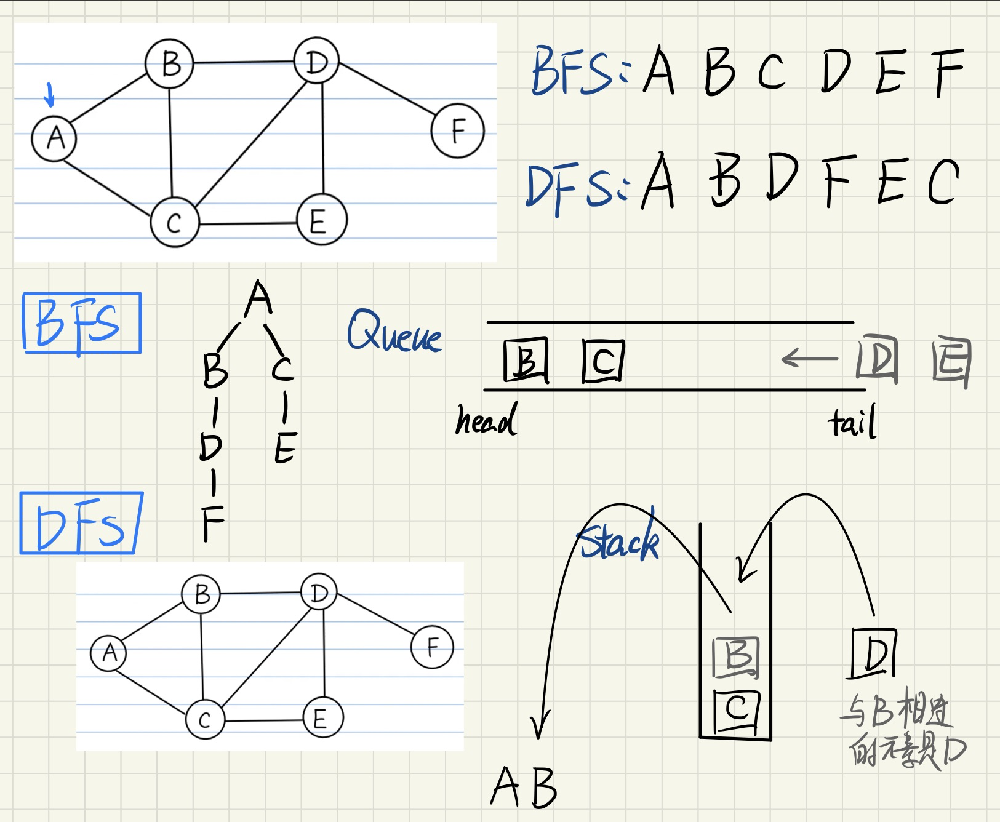

# BFS&DFS



## 1. 数据结构

### 1.1 graph表示图的方法

> 使用一个dist()，并且key值是一个数组

```python
self.graph = {
    "A": ["B", "C"],
    "B": ["A", "C", "D"],
    "C": ["A", "B", "D", "E"],
    "D": ["B", "C", "E", "F"],
    "E": ["C", "D"],
    "F": ["D"],
}
```

### 1.2 其他数据结构

- `set()`来存储已经遍历过的顶点
- `list()`既可用来表示队列，也可以用来表示栈


## 2. 算法实现

### 2.1 BFS

- 借助队列，类似一棵二叉树的层次遍历

```python
def BFS(self, v):
    queue = []  # ★利用数组模拟队列
    seen = set()  # seen集合用来标记已经加入的顶点
    queue.append(v)
    seen.add(v)
    while len(queue):
        vertex = queue.pop(0)
        print(vertex, end=' ')
        for i in self.graph[vertex]:
            if i not in seen:
                queue.append(i)
                seen.add(i)
```

### 2.2 DFS

- 方法一：借助栈

```python
def DFS(self, v):
    stack = []  # ★利用数组模拟栈
    seen = set()
    stack.append(v)
    seen.add(v)
    while len(stack):
        vertex = stack.pop()  # 栈的输出是"后进先出"
        print(vertex, end=' ')
        for i in self.graph[vertex]:
            if i not in seen:
                stack.append(i)
                seen.add(i)
```

- 方法二：递归

```python
def DFS2(self, v):
    seen = set()
    def DFS_recur(vertex):
        seen.add(vertex)
        print(vertex, end=' ')
        for i in self.graph[vertex]:
            if i not in seen:
                DFS_recur(i)

    DFS_recur(v)
```


## 3. 应用

#### 3.1 BFS的应用：最短路径

```python
# BFS的应用：最短路径
# 原理，每次判断相邻的节点的时候可以顺手保存一个parent字典
def BFS_shortest_path(self, v):
    queue = []
    seen = set()
    queue.append(v)
    seen.add(v)
    parent = {}
    while len(queue):
        vertex = queue.pop(0)
        # print(vertex)
        for i in self.graph[vertex]:
            if i not in seen:
                queue.append(i)
                seen.add(i)
                parent[i] = vertex  # 说明是i的前驱是vertex
    return parent
```


## 4. 总结

- python中灵活利用dist和list这两个基本的容器可以表示复杂的数据结构
- BFS算法稍微改进一下可以得到应用


## 5. 参考

- [B站视频教程：[Python] BFS和DFS算法](https://www.bilibili.com/video/BV1Ks411579J/?spm_id_from=333.788.recommend_more_video.1)
- [geeksforgeeks算法：depth-first-search-or-dfs-for-a-graph](https://www.geeksforgeeks.org/depth-first-search-or-dfs-for-a-graph/?ref=gcse)

