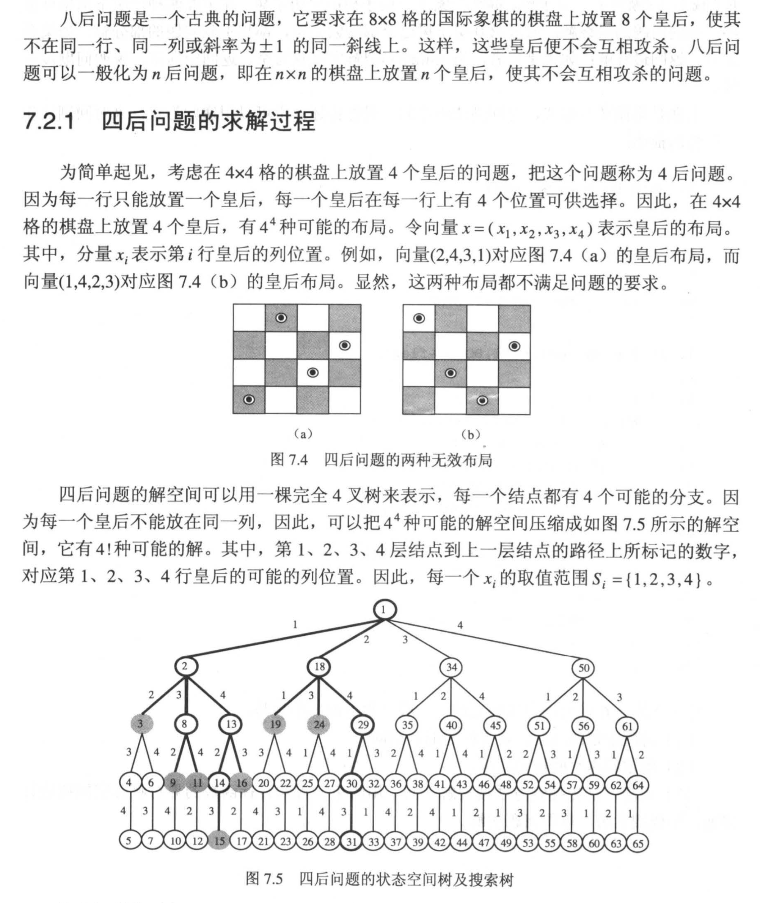

# 背景：n后问题（四后问题）



## 迭代回溯

```c++
/*
 * 迭代回溯
 */
void Queen::IterativeBacktrack() {
    int t = 1;  // 递归深度
    x[1] = 0;   // 将第一列的放置棋子（行）初始化
    while (t > 0) {
        x[t] += 1;
        while ((x[t]<=n)&&!Place(t)) {  // 如果将要放置的行没有溢出，且不满足放置条件
            x[t] += 1;
        }
        if (x[t] <= n) {                // 如果这次放置的行满足条件
            if (t==n){
                sum++;            // 如果达到Solution条件，输出值
            } else {
                t++;                    // 递归深度+1
                x[t] = 0;               // 将这次放置的不满足的棋子（行）初始化
            }
        } else {
            t--;                        // 递归深度-1
        }
    }
}
```


# C++语法知识

## 类的友元函数

是定义在类外部，但有权访问类的所有私有（private）成员和保护（protected）成员。

> 尽管友元函数的原型有在类的定义中出现过，但是友元函数并不是成员函数。

- 友元可以是一个函数，该函数被称为友元函数

- 友元也可以是一个类，该类被称为友元类，在这种情况下，整个类及其所有成员都是友元。

如果要声明函数为一个类的友元，需要在类定义中该函数原型前使用关键字 **friend**，如下所示：

```c++
class Box
{
   double width;
public:
   double length;
   friend void printWidth( Box box );
   void setWidth( double wid );
};
```

声明类 ClassTwo 的所有成员函数作为类 ClassOne 的友元，需要在类 ClassOne 的定义中放置如下声明：

```c++
friend class ClassTwo;
```

## 类的成员函数

类的成员函数是指那些把定义和原型写在类定义内部的函数，就像类定义中的其他变量一样。类成员函数是类的一个成员，它可以操作类的任意对象，可以访问对象中的所有成员。

# 局部搜索

### 爬山法

```c++
n := s;
LOOP: IF GOAL(n) THEN EXIT(SUCCESS);
```

