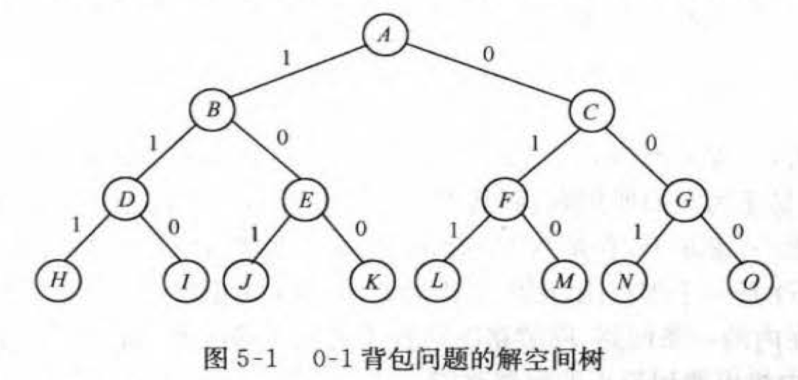

# 回溯法

> 深度优先搜索的策略：只要搜索到问题的一个解就可以结束。以深度优先方式系统搜索问题解的算法，适用于**解组合数较大**的问题。

#### 解决的问题

- 需要找出它的解集
- 满足某些约束条件的最佳解

#### 基本做法

- 搜索

- 能避免不必要搜索的穷举式搜索法。（适合解一些组合数相当大的问题）


# 算法框架★

## 1.问题的解空间

#### 解空间

> 这样的问题有个共同的特点，求解的问题都有n个输入

一般把X = ( x 1 , x 2 , …, X n ) 称为问题的**解向量**，把x i的所有可能取值称为问题的**解空间**。

- **问题的解向量**：希望一个问题的解能够表示成一个n元式(x1，x2，…xn)的形式

- **显约束**：对分量xi的取值限定

- **隐约束**：为满足问题的解而对不同分量之间施加的约束

- **解空间**：对于问题的一个实例，**解向量满足显式约束条件的所有多元组，**构成了该实例的一个解空间。

#### 解空间树

例如,对于n=3时的0- 1 背包间题,可用一棵完全二叉树表示其解空间




## 2.回溯法的基本思想

#### 生成问题状态的基本方法

- **生成问题的几种结点**

- - **扩展结点**：正在产生儿子的结点
  - **活结点**：自身已生成但其儿子还没有全部生成的结点
  - **死结点**：所有儿子已经产生的结点

- **状态生成法**

- - **深度优先问题★**：如果对一个扩展节点R，一旦产生了它的一个儿子C，就把C当作新的扩展节点。

  - - 在完成对子树C（以C为根的子树）的穷尽搜索后。
    - 将R重新变成扩展结点，继续生成R的下一个儿子。（如果存在）

  - **宽度优先问题**：在一个扩展结点变成死结点之前，它一直是扩展结点。

- **回溯法**：具有**限界函数**的**深度优先**的**生成法**称为回溯法

- - 为了避免生成那些不可能产生最佳的问题状态，要不断地利用界限函数(bounding function)来处死那些实际上不可能产生所需解的活结点。

#### 使用回溯法的解题步骤

1. 对所给定的问题，定义问题的解空间。
2. 确定状态空间树的结构。

3. 用深度优先方式搜索解空间，并在搜索过程中用减枝函数避免无效搜索

   - 用约束函数在扩展节点处剪去不满足约束的子树
   - 用限界函数减去得不到最优解的子树

   

## 3.算法模版

#### 递归回溯

```c++
void Backtrack(int t){
  if (t > n) Output(x);
  	else
      for (inti= f(n,t ) ;i < = g(n,t);i ++ ) {
        x[t] = h(i);
        if (Constraint(t)&.&.Bound(t)) Backtrack(t + 1);
      }
}
```

#### 迭代回溯

```c++
void IteraciveBackTrack(void){
	int t = 1;
  while (t > 0) {
  	if (f(n,t) <= g(n,t))
    	for(int i = f(n,t) ; i <= g(n,t); i++ ) {
      	x[t] = h(i) ;
        if (Constraint(t)&.&.Bou nd(t)) {
        	if (Solution(t)) Output( x) ;
          else t + + ;
        }
      else t--;
     }
}
```


# 参考资料

- 计算机算法设计与分析/ 王晓东编著.—3 版. —北京:电子工业出版社，2007.5