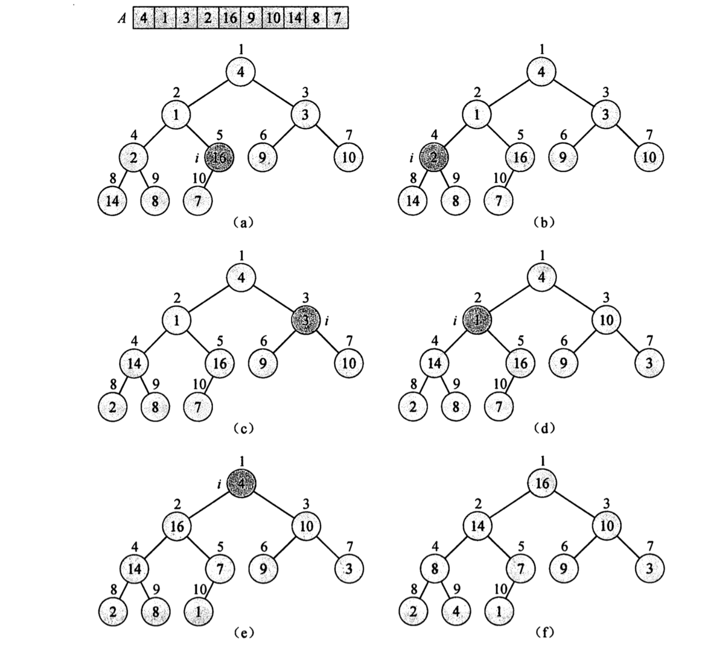

# 堆排序

## 1.堆 Heap

逻辑存储：近似完全二叉树

物理存储：数组

- 从下标1开始，左孩子`2*i`，右孩子`2*i+1`

  > 注意：如果下标0开始作为根节点，则i的左孩子的下标为`i*2+1`，i的右孩子下标为`i*2+2`

因为堆逻辑存储是完全二叉树，具有特性

- 叶子节点
  - 在数组中的下标位置为：`1～⌊A.length/2⌋`
- 非叶子结点
  - 在数组中的下标位置为：`⌊A.length/2⌋+1 ~ A.length`

## 2. 维护堆的性质 MAX-HEAPIFY

以最大堆为例，堆具有性质：

`A[PARENT(i)] ≥ A[i]`：父节点的值都大于子节点

对i开始维护的性质的**算法流程：**

> 自顶向下


1. 对于i和i的左孩子、i的右孩子选出最大值largest
2. 交换位置（如有必要），使得largest的位置处于i
3. 将被交换的位置向下递归执行算法

#### 算法实现

```c++
void maxHeapify(vector<int>& a, int i, int heapSize) {
    int l = i * 2;
    int r = i * 2 + 1;
    int largest = i;
    if (l < heapSize && a[l] > a[largest]) {
        largest = l;
    }
    if (r < heapSize && a[r] > a[largest]) {
        largest = r;
    }
    if (largest != i) {
        swap(a[i], a[largest]);
        maxHeapify(a, largest, heapSize);
    }
}
```


## 3.建堆


#### 算法流程

1. 从最后一个非叶子节点开始（自底向上）～ 根节点：
   - 执行堆维护 MAX-HEAPIFY

#### 算法实现

```c++
void buildMaxHeap(vector<int> &a, int heapSize) {
    for (int i = heapSize / 2; i > 0; --i) {
        maxHeapify(a, i, heapSize);
    }
}
```

#### 把一个无需数组构造成最大堆的过程



## 6. 参考资料

- 算法导论（原书第3 版）/(美)科尔曼（Carmen ,T. H.）等著；殷建平等译.北京:机械工业出版社，2013.1

